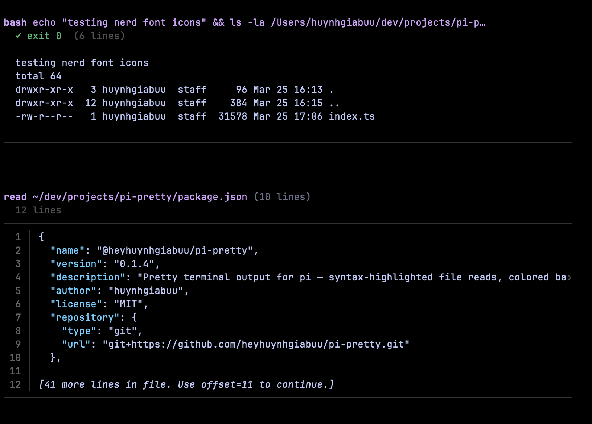
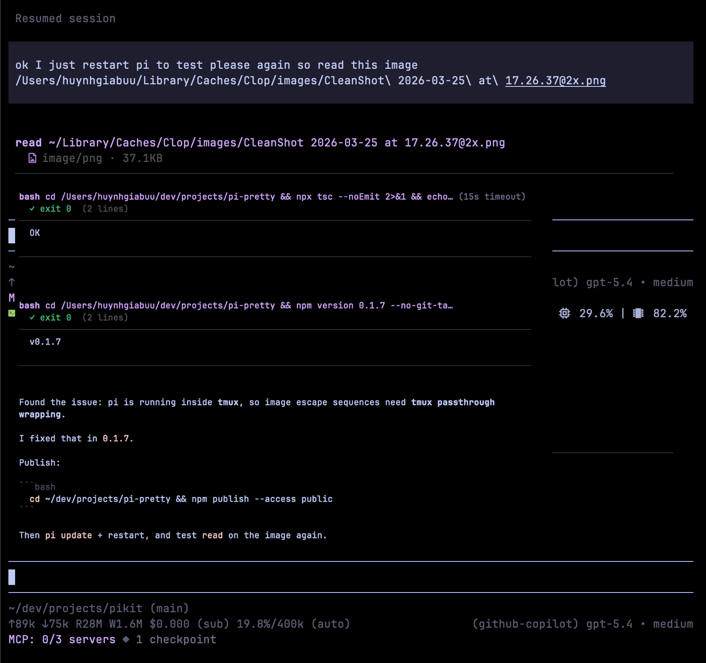

# pi-pretty

[](https://www.npmjs.com/package/@heyhuynhgiabuu/pi-pretty)
[](https://github.com/buddingnewinsights/pi-pretty/releases/latest)

A [pi](https://pi.dev) extension that upgrades built-in tool output in the terminal without changing tool behavior.

It currently enhances:

- **`read`**: syntax-highlighted text previews with line numbers, plus inline image rendering when the terminal supports it
- **`bash`**: colored exit summary (`exit 0`/`exit 1`) with a preview body of command output
- **`ls`**: optional Nerd Font file icons with a tree-style directory layout

> For compact `find` / `grep` / `edit` / `write` rendering, pair it with `pi-tui-overrides`.

> Companion to [@heyhuynhgiabuu/pi-diff](https://github.com/buddingnewinsights/pi-diff) for `write`/`edit` diff rendering.

## Install

```bash
pi install npm:@heyhuynhgiabuu/pi-pretty
```

Latest release: https://github.com/buddingnewinsights/pi-pretty/releases/latest

Or load locally:

```bash
pi -e ./src/index.ts
```

## Screenshots


*`bash` exit summary + output preview, and syntax-highlighted `read` text output.*


*`ls` with optional Nerd Font icons and tree-oriented rendering.*


*`read` rendering an image inline in supported terminals.*

## Terminal support for inline images

Inline image previews are supported in **Ghostty**, **Kitty**, **iTerm2**, and **WezTerm**.  
When running in **tmux**, pi-pretty uses passthrough escape sequences.

> tmux must allow passthrough. Enable it with:
>
> ```tmux
> set -g allow-passthrough on
> ```
>
> (or run once in a session: `tmux set -g allow-passthrough on`)

## Configuration

Optional environment variables:

- `PRETTY_THEME` (default: `github-dark`)
- `PRETTY_MAX_HL_CHARS` (default: `80000`)
- `PRETTY_MAX_PREVIEW_LINES` (default: `80`)
- `PRETTY_CACHE_LIMIT` (default: `128`)
- `PRETTY_ICONS` (`none` by default, set to `nerd` to enable icons)

## Development

```bash
npm install
npm run typecheck
npm run lint
npm test
```

## License

MIT — [huynhgiabuu](https://github.com/buddingnewinsights)
